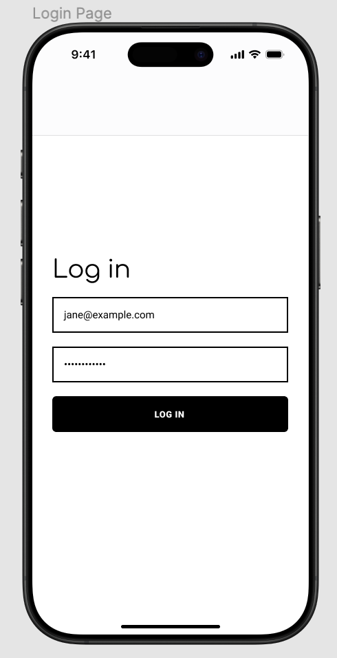
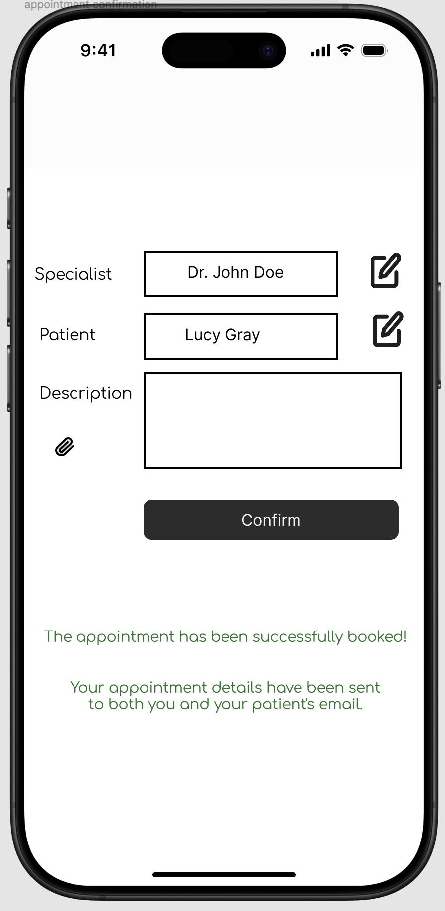
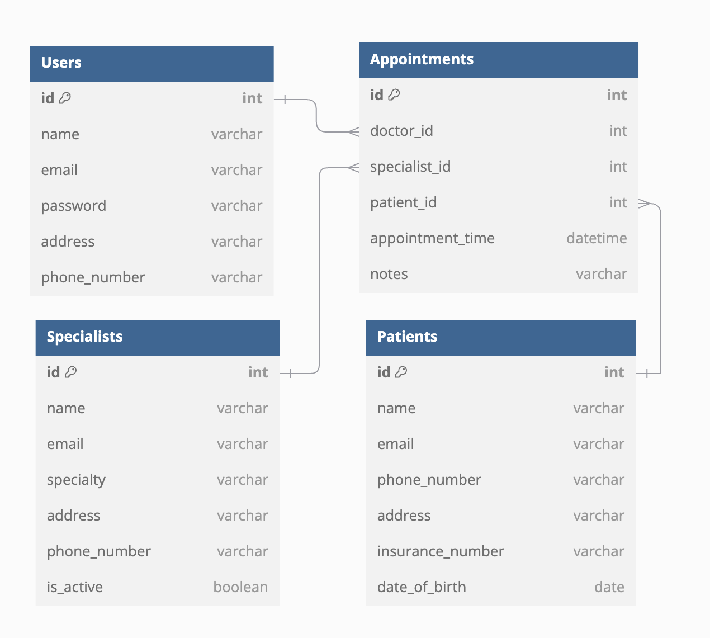

# Project Title
MedPass – Simplifying Medical Appointment Referrals

## Overview

MedPass aims to streamline the process of family doctors booking appointments with specialists on behalf of their patients. The MVP focuses on allowing a family doctor to log in, access their dashboard, and book an appointment for a patient with a specialist.

### Problem

The traditional process for family doctors to coordinate specialist appointments is time-consuming and inefficient. It often involves multiple phone calls, incomplete communication, and a lack of visibility into specialists' availability.

MedPass provides a centralized platform for family doctors to manage referrals and appointments efficiently, saving time and improving patient care.

### User Profile

Primary User: Family Doctors

Goal:
Log in securely, access their dashboard, and book an appointment for a patient with a specialist.

Considerations:
Protect sensitive patient data with secure authentication.
Provide an intuitive and user-friendly interface to simplify the booking process.

### Features

## User Story:
“As a family doctor, I want to log in to my dashboard and book an appointment for a patient with a specialist.”

## Key Features:

1-Secure Login:
Authenticate family doctors using JWT.

2-Specialist Search and Selection:
Search for specialists by name, specialty.
View available time slots and select a specialist.

3-Patient Selection:
Search for patient by name, insurance#.

4-Booking Confirmation:
Confirmation message with appointment details.
Option to add notes (e.g., reason for referral).
option to upload files 

## Implementation

### Tech Stack

Tech Stack

Frontend:
React
JavaScript
MUI
SASS

Backend:
Express
MySQL

Client Libraries:
react, react-router, axios

Server Libraries:
knex, express, bcrypt for password hashing

### APIs

POST /api/login
Authenticate a family doctor.
Response Example:
{ "token": "jwt_token", "user": { "id": 1, "name": "Dr. John Doe" } }

GET /api/specialist
Fetch a list of specialists with optional filters for name, specialty.
Response Example:
[
  {
    "id": 1,
    "name": "Dr. Jane Smith",
    "email": "jane.smith@example.com",
    "specialty": "Cardiology",
    "address": "123 Heart Lane, Toronto",
    "phone_number": "123-456-7890",
    "availability": ["2024-12-05T10:30:00"]
  }
]

GET /api/patient
Fetch a list of patients associated with the logged-in doctor.
Response Example:
[
  {
    "id": 1,
    "name": "John Doe",
    "email": "john.doe@example.com",
    "phone_number": "987-654-3210",
    "address": "456 Maple St, Toronto",
    "insurance_number": "INS12345",
    "date_of_birth": "1990-01-01"
  }
]

POST /api/appointment
Book an appointment.
Response Example:
{
  "id": 1,
  "status": "confirmed",
  "appointment_details": {
    "specialist": "Dr. Jane Smith",
    "patient": "John Doe",
    "date": "2024-12-05",
    "time": "10:30 AM"
    "description": "the condition is ..."
  }
}

### Sitemap

- 1-Home page / login page
- 2-Dashboard
- 3-Specialist Selection
- 4-Patient Selection
- 5-Booking Confirmation

### Mockups

#### Login Page

#### Dashboard Page

#### pecialist Selection Page

#### Patient Selection Page

#### Booking Confirmation Page

### Data

Database Schema:

Users (Family Doctors) Table:
id, name, email, password, address, phone_number
Specialists Table:
id, name, email, specialty, address, phone_number, availability
Patients Table:
id, name, email, phone_number, address, insurance_number, date_of_birth
Appointments Table:
id, doctor_id, specialist_id, patient_id, appointment_time, notes

### Endpoints

**GET /api/specialists**
Fetches a list of specialists.
Parameters:
name, specialty 
[
  {
    "id": 1,
    "name": "Dr. Jane Smith",
    "specialty": "Cardiology",
    "email": "jane.smith@example.com",
    "phone_number": "123-456-7890",
    "address": "123 Heart Lane, Toronto",
    "first availability": ["2024-12-05T10:30:00"]
  }
]

**GET /api/patients**

Fetches a list of patient.

Parameters:
name, insurance# 
[
  {
    "id": 1,
    "name": "Dr. Jane Smith",
    "insurance_number": "Cardiology",
    "email": "jane.smith@example.com",
    "phone_number": "123-456-7890",
    "address": "123 Heart Lane, Toronto"
  }
]
**POST /api/appointments**
confirm an appointment.

Parameters:
-specialist_id: Selected specialist's ID.
-patient_id: Selected patient's ID.
-appointment_time : Appointment date and time.
-notes: Additional notes about the appointment.

**POST /api/login**
Authenticates a family doctor.

Parameters:

-email
-password
{
  "token": "jwt_token",
  "user": { "id": 1, "name": "Dr. John Doe" }
}

## Roadmap

Day(1-3) Set Up Client:

Create a React project (vite or create-react-app).
Create initial routes (/login, /dashboard, /booking/specialist, /booking/patient, /booking/confirmation).
Set up basic folder structure for components, pages, and services (API handlers).
Set Up Server:

Initialize Express project.
Add routing for planned endpoints with placeholder responses.
Install required libraries (express, knex, bcrypt, etc.).
Database Setup:

Design database schema and migrations for:
Users (Family doctors)
Specialists
Patients
Appointments
Create sample data seeds for testing.

Day 3-4: Implement Login and Authentication
Login Feature:

Build the login page with form inputs for email and password.
Add form validation (e.g., required fields, email format).
Implement POST /api/login endpoint to authenticate doctors using JWT.
JWT Authentication:

Add middleware to secure protected routes on the server.
Store JWT tokens in local storage on the client.
Redirect to Dashboard:

After successful login, redirect the user to the /dashboard page.
Day 5-6 (Nov 24-25): Specialist Search and Selection
Specialist List:

Create the UI to display a searchable and filterable list of specialists.
Build the GET /api/specialists endpoint to retrieve specialists from the backend.
Calendar Integration:

Add a calendar component to show available time slots for specialists.
Allow doctors to select a specialist and a time slot.

Day 7-8: Patient Search and Selection
Patient Selection UI:
Create a page to display and search for patients.
Build the GET /api/patients endpoint to fetch the list of patients from the backend.
Optional Notes:

Add an input field for optional notes (e.g., reason for referral).
Day 9-10 (Nov 28-29): Booking and Confirmation
Booking API:

Implement the POST /api/appointments endpoint to save the booking in the database.
Confirmation Page:

Create a confirmation page to display appointment details:
Specialist name
Patient name
Date and time
Include a "Back to Dashboard" button.

Day 11: Testing and Bug Fixes
End-to-End Testing:

Test the entire flow: login → specialist selection → patient selection → booking → confirmation.
Identify and fix bugs.

## Nice-to-haves

1- Role-based dashboards for specialists and patients.
2-Advanced search filters for specialists (e.g., location, ratings).
3-Appointment history for family doctors.
4-Quick statistics for users dashboard (e.g.,number of appointment, status of appointments)
5-building users profile more efficient

